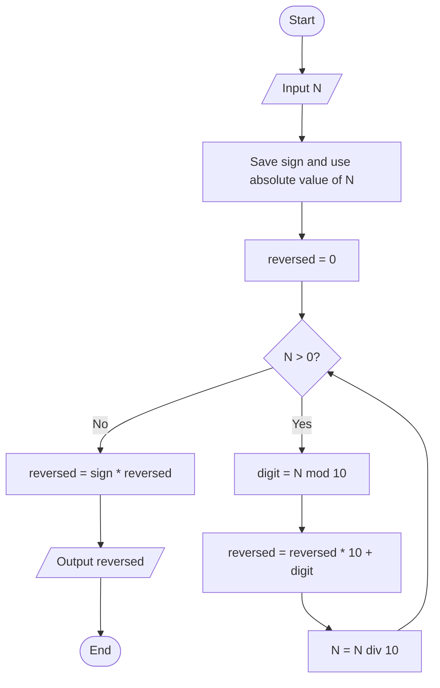

# FC-2: Number Digit Reversal Flowchart

```mermaid
flowchart TD
    A([Start]) --> B[/Input N/]
    B --> C[Save sign and use absolute value of N]
    C --> D[reversed = 0]
    D --> E{N > 0?}
    E -- No --> F[reversed = sign * reversed]
    F --> G[/Output reversed/]
    G --> H([End])
    E -- Yes --> I[digit = N mod 10]
    I --> J[reversed = reversed * 10 + digit]
    J --> K[N = N div 10]
    K --> E
```
