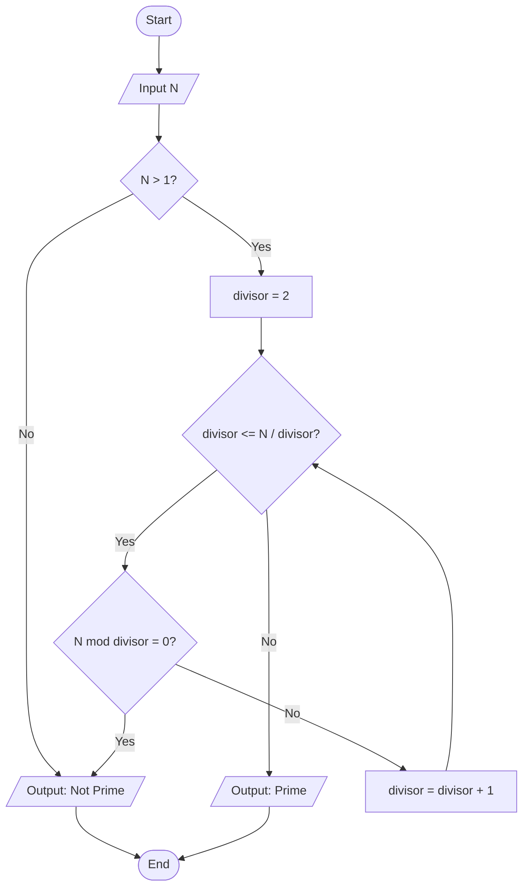

# FC-1: Prime Number Flowchart

```mermaid
flowchart TD
    A([Start]) --> B[/Input N/]
    B --> C{N > 1?}
    C -- No --> D[/Output: Not Prime/]
    C -- Yes --> E[divisor = 2]
    E --> F{divisor <= N / divisor?}
    F -- No --> G[/Output: Prime/]
    F -- Yes --> H{N mod divisor = 0?}
    H -- Yes --> D
    H -- No --> I[divisor = divisor + 1]
    I --> F
    D --> J([End])
    G --> J
```
